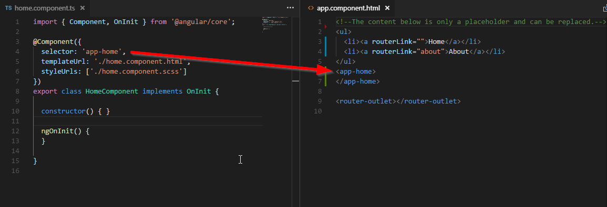

# Course : Learn Angular 5 from Scratch : Free
[Udemy Course ](https://www.udemy.com/angular-5/learn/v4/overview)

## 1. Install Angular 5

### Install Angular Command Line Interface (CLI)
We only need to install *angular cli* once.

[Angular CLI Documentation](https://github.com/angular/angular-cli/wiki)
```
$ npm install @angular/cli -g
```

### Create project 
Command to create angular base with scss and rounting:
```
$ ng new ng5 --style=scss --routing
```

### Run DEV Application Server
```sh
$ cd ng5
$ ng s # or: ng server
```

## 2. Components
### Basic Commands
```sh
$ ng g c home # Generate Component home
```
How to use component:


## 3. Templating & Styling
[Emmet (HTML genrator)](https://docs.emmet.io/cheat-sheet/)

## 2. Components
```sh
$ ng g c about # Generate Component about
```

## 4. Interpolation, Property & Event Binding
- Interpolation : `value="{{btnText}}"`
- Property Binding : `[value]="btnText"`
- Event Binding : `(click)="addItem()"`
    - Add function to `home.component.ts`:         
        ```typescript
        addItem() {
            this.goals.push(this.goalText);
            this.goalText = '';
            this.itemCount = this.goals.length;
        }
        ```

### Two way data binding :
In order to use ng-model we have to install `@angular/forms`

1. Edit app.module.ts. 
    - Add import
        - `import {FormsModule} from '@angular/forms';`
    - Add to imports array
        - `FormsModule`
2. Two way databinding html attribute :
    - square brackets with parentheses inside `[(ngModel)]="goalText"`
3. How to render array :
    ```html
    <p class="life-container" *ngFor="let goal of goals">
            {{goal}}
    </p>
    ```


## 5. Animation
1. Install @angular/animations :
    ```sh
    $ npm install @angular/animations@latest --save
    ```
    - Setup app.modules.ts :  `import {BrowserAnimationsModule} from '@angular/platform-browser/animations';`
    - Import animations on `home.component.ts` : 
        ```typescript
        import {trigger, style, transition, animate, keyframes, stagger} from '@angular/animations';
        ```


## 6. Routing
### `app-routing.module.ts` 
Add :
```typescript
import { HomeComponent } from './home/home.component'
import { AboutComponent } from './about/about.component'

const routes: Routes = [
  { path:'', component: HomeComponent },
  { path:'about/:id', component: AboutComponent }
];
```
### `app.component.html` :
Change Html to :
```html
<ul>
  <li><a routerLink="">Home</a></li>
  <li><a routerLink="about/48">About</a></li>
</ul>
<router-outlet></router-outlet>
```

### `about.component.ts`
Add:
```typescript
import { ActivatedRoute, Router } from '@angular/router';

...
...

  constructor(private route: ActivatedRoute,private router: Router) 
  {
    // this.route.params.subscribe(res=>console.log(res.id));
  }

  sendMeHome()
  {
    this.router.navigate(['']);
  }
```

### `about.component.html`
Add:
```html
  <a href="javascript:;" (click)="sendMeHome()">
    <strong>take me back</strong>
  </a>
```


## 7 Services
```sh
$ ng g s data
```
Changes: 
```
source/src/app/about/about.component.html
source/src/app/about/about.component.ts
source/src/app/app.module.ts
source/src/app/data.service.ts
source/src/app/home/home.component.ts
```